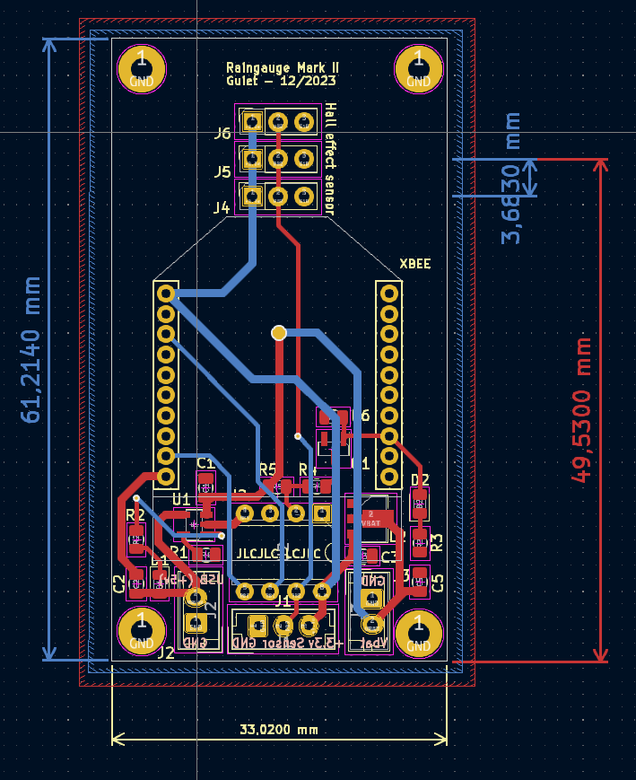
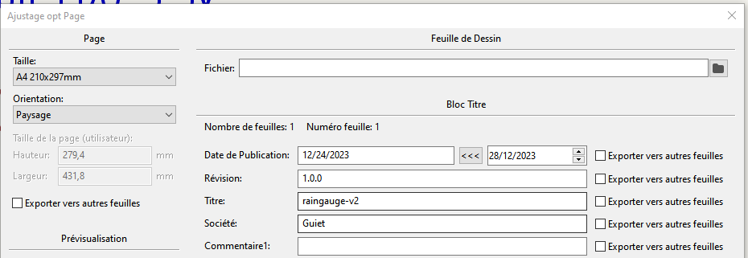
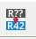

# Raingauge v2

## 3D representation

## Compute how much water has fell ?

Funnel diameter = 15cm = 150 mm = 0.15m
Volume of each bucket (around) = 2.5ml = 0.0025l

Funnel area = pi*R² = 3.14 * 0.075² = 0,017669025 m2

X= 1/Aire * V = (1/0,017669025) * 0.0025 = 0.141490543 L par m2 (ou mm)

1mm = Une litre d'eau tombé sur une mètre carré

Résolution de mon pluvio = 0.15 L/m2 (c'est dans la norme)

## Programming the ATtiny85

Here is the ATtiny 85 pinout

Using Arduino IDE v2, use this tutorial : <https://www.instructables.com/How-to-Program-an-Attiny85-From-an-Arduino-Uno/>

1. Use this following URL to add ATtiny Board to Arduino IE <https://raw.githubusercontent.com/damellis/attiny/ide-1.6.x-boards-manager/package_damellis_attiny_index.json>. File => Preferences => Aditional Board URL
2. Install the ATtiny boards (Board Manager on the menu on the left, then Install)
3. __Burn the ArduinoISP Exemple in the Arduino Board (select Arduino Board)__ => Don't forget that ! and make sure ATTiny pin are well connected to the bread board
4. Select ATtiny 85 board
5. Select Clock Internal 1 Mhz (it is ok for this project)
6. Select Programmer => Arduino as ISP
7. Burn Boatloader
8. Open sketch to upload then click on the menu Sketch => Upload using programmer

A quick overview of the Arduino and ATtiny 85 connexion.

__To program (Arduino <=> ATtiny 85):__

VCC (3.3v ou 5V) <=> VCC (ATtiny pin8)
Arduino GND <=> GND (ATtiny pin4)
Arduino Pin 10 <=> ATtiny Pin1
Arduino Pin 11 <=> ATtiny Pin5
Arduino Pin 12 <=> ATTiny Pin6
Arduino Pin 13 <=> ATTiny Pin7

## Interrupt and power saving stuff with ATtiny 85

See <https://forum.arduino.cc/t/attiny84-sleep-issues/199824/8>
See <http://www.gammon.com.au/power>
See <https://www.marcelpost.com/wiki/index.php/ATtiny84_ADC>

Extract from ATtiny datasheet p49.

²> 9.2 External Interrupts
> Note that recognition of falling or rising edge interrupts on INT0 requires the presence of an
> I/O clock, as described in “Clock Sources” on page 25.

## How to debug using Serial Adapter 

Careful use 3.3v on your serial adapter.

Connect this way:

USB To Serial Adapter <-> ATTiny
GND <-> GND
RX <-> Pin 7 (PB2) 

Then, power the circuit by an external alimentation at 3.3v (no need to power the USB Serial Adapter to VCC pin)

## Power consumption

Using the PPK II (Nordic Power Profiler Kit II), the device consume about 10uA when sleeping and 55mA when sending data.

VOUT of the PPK II should be connected to VIN of the device and GND to GND.

See [Get your Power Profiler Kit II up and running](https://www.youtube.com/watch?v=B42lPvkUSoc)

## Configuring XBee S1 with XCTU v6.5.13

I am using old XBee S1.

At the begining of the project I was using the transparent mode (AT).

But I changed to API Mode as it offers more options (like the RSSI)

### XBee firmware update

Update the XBee firmware with last version using XCTU v6.5.13

Click on Default (To reset XBee to factory default), then Write
Click on Update to upload the last firmware available for this XBee S1 unit

In my case as of 2023/12 :

To make the Xbee talks to each other just config them with the same Channel and PAN (Personnal Area Network ID). Messages will be broadcasted.

### Test XBee communication (deprecated as it shows transparent mode)

You can use XCTU to test that a mesage is correcly sent.

In my case I have got an Raspberry Pi with NodeRed installed and an XBeee connected to the Raspberry Pi.

Just use the XCTU Console and send a test packet, here : "Rainguage projet rocks!" in a JSON format

Here a part of the NodeRed flow I am using.

Careful, you must configure the NodeRed serial flow to split a message as soon as the '}' character is reveiced (end of JSON message)

If everything is going well then you should received the message on the NodeRed debug console

### XBee pinout

### Sleep mode

To config the Xee to use the sleep mode, just change the sleep mode setting

Sleep mode will be control by pin 9, see <https://www.digi.com/resources/documentation/Digidocs/90001456-13/reference/r_wk_sleep_mode.htm>

PIN 9 HIGH : Xbee sleeps
PIN 9 DOWN : Xbee awake

### XBee speed communication

Don't forget to set Xbee serial speed communication to 38400 bauds as the ATtinySerialOut library use this speed.

### New way of communicating : Using the API Mode

I was using Transparent Mode before (AT) but there is another mode called API Mode that offers more options and controls

See [API mode in detail](https://www.digi.com/resources/documentation/Digidocs/90001942-13/concepts/c_api_mode_detailed.htm?TocPath=XBee%20API%20mode%7C_____1)

See [API Mode 2 frame Structure](https://www.digi.com/resources/documentation/Digidocs/90001942-13/concepts/c_api_frame_structure.htm?tocpath=XBee%20API%20mode%7C_____2)C

Supported frames are listed here : <https://www.digi.com/resources/documentation/Digidocs/90001942-13/reference/r_supported_frames_zigbee.htm?tocpath=API%20mode%7C_____3>

I am using the 64-bit Transmit Request - 0x00 frame. I know that I should use the 0x10 frame tpye but I am using old XBee S1 and they only support 802.15.4 protocol stack.

See [64-bit Transmit Request - 0x00](https://www.digi.com/resources/documentation/Digidocs/90001477/reference/r_frame_0x00.htm?tocpath=API%20frames%7C_____3)

In API Mode 2, some characters need to be escaped:

See : <https://stackoverflow.com/questions/55861574/difference-between-api-1-and-api-2-mode-of-xbee>

* 0x7E (Start of frame) => 0x7D 0x5E (escaped)
* 0x7D (start of escape sequence) => 0x7D 0x5D (escaped)
* 0x13 (XOFF) => 0x7D 0x33 (escaped)
* 0x11 (XON) =>	0x7D 0x31 (escaped)

In API 2 mode, the length field does not include any escape character in the frame and the checksum is calculated with non-escaped data.

All bytes except for the start delimiter must be escaped if needed.

* End Device XBee configuration

Here is what I changed in the XBee configuration with XCTU

CH - Channel = C
ID - PAN ID = 666
SM - Sleep mode = Pin Hibernate [1]
BD - Interface Data Rate = 38400 [5]
AP - API Enable = API Enabled w/PPP [2]

* Coordinator XBee configuration

CH - Channel = C
ID - PAN ID = 666
CE - Coordinator Enable = Coordinator [1]
BD - Interface Data Rate = 38400 [5]
AP - API Enable = API Enabled w/PPP [2]

## Librairies used in this project

* ATTinySerialOut

To communicate with the XBee (send data), this project used the following library : `ATtinySerialOut`, version 2.2.0 (2023/12)

GitHub : <https://github.com/ArminJo/ATtinySerialOut/>

* LowPower

This project is using this library <https://github.com/ortegafernando/Low-Power> to allow the ATTiny 85 power management

__Note__

To use an external library for a Arduino IDE Project, just copy the library source in the librairies folder of Arduino IDE

## Freecad

__Some notes__

* On ne peut pas utiliser le mirroring sur la pièce que l'on veut "mirrorer" n'a pas de lien avec un objet du body en cours (pas de corps multiples dans un body)

* Utilisation de ShapeBinder pour pouvoir avoir des points de repères d'un autre body (voir vidéo : <https://www.youtube.com/watch?v=KYD9Ojugi8Q>)

### Support tipping bucket

Les trous pour placer les inserts font 4.2mm sur Freecad. les inserts à utiliser sont des M3*4 (4 mm de haut pour type vis M3)

## Pull up / pull down

Quick reminder about pullup/pulldown : <https://arduino.developpez.com/cahiers-pratiques/resistance-pullup-pulldown/>

## Kicad

Ce tuto : <https://www.youtube.com/watch?v=RpVIrzEUsIM> ou <https://www.youtube.com/watch?v=dAck3bxzehA> ou <https://www.youtube.com/watch?v=nYybg5KdaT8>

__Note__ :

Suppression du snap sur le PCB Editor afin de placer les composants à un endroits précis : utiliser la touche CTRL

__Grandes étapes__

1. Editeur de schéma électronique, remplir le cartouche pour définir les informations du PCB

Fichier, Ajustage page

2. Place all your components

Shortcut

M : Move
R : Rotate
Tab  : Pour bouger le composant avec les fils accrochés

Pour vérifier que le circuit est ok on peut cliquer sur le bouton : 

__Note__

* Essayer de mettre par convention VCC en haut et GND en bas au niveau du positionnement
* Il existe des labels global et local (A voir sur le net la différence)
* Possibilité de créer des feuilles hiérarchiques (si jamais on a un schéma très grand alors on peut le splitter, après y'a les notions de labels hiérarchiques, global, etc etc...)
* Il faut bien penser à définir les pins qui alimentent le schéma électrique (= PWR_FLAG)

3. Annotation de la schématique (pour numéroter les composants)

Normalement avec Kicad 7, les éléments sont numérotés automatiquement.
Sinon, cliquer sur le bouton: 

4. Assigner les empreintes des composants de la schématique

5. Génération de la net liste

Inutile dans Kicad 7 ?

6. Editeur de circuit imprimé et lecture de la net liste

Inutile dans Kicad 7 ?

7. Placement des composants sur l'éditeur de PBB

On passe sur cet écran en cliquant sur :

Récupération des contraintes JLCPCB : <https://github.com/sethhillbrand/kicad_templates/tree/master/JLCPCB_1-2Layer> prendre le fichier JLCPCB.pro

Fichier, Ajustage page pour personnaliser le cartouche comme pour l'éditeur de schéma électronique

Pour gérer la largeur des pistes en fonction du type de piste (VCC) : Fichiers, Options CI, Classe d'Equipots, j'utilise 0.4mm pour les pistes classiques et 0.8mm en VCC

Penser à modifier la valeur par défault de la largeur des pistes à 0.4mm

Short Cut

v: change layer (front / bottom)

__Notes__

Layers intéressantes 

F. Silks pour écrire sur le front Silk Screen
B. Silks pour écrire sur le bottom Silk Screen
Dwgs.User pour faire des dessins
F. Courtyard : place que prend le composant front
B. Courtyard : place que prend le composant bottom (on peut afficher ou pas)

Quand il y a beaucoup d'éléments sur le PCB, on peut utiliser le filtre de sélection afin de limiter la sélection à l'objet que l'on désire (exemple j'avais besoin de bouger les références des composants sur la layer silkscreen)

8. Couche Edge cut (contour de carte)

On trace autour des composants pour couper le PCB à la taille désirée

9. Routage

Pour la largeur, bien penser à sélectionner utiliser largeur de netclasse.
Attention, dans netclasse il faut avoir penser à modifier la valeur par défaut pour la largeur des pistes à 0.4mm et mettre 0.8mm pour les pistes de puissance (PWR)

Voici ce qu'il faut respecter lors que l'on trace des routages pour éviter les pbs d'électromagnétisme.

Quand on a des tracks qui se croisent sur la couche du dessus et dessous il faut qu'elles soient perpendiculaires:

Couche F. Cu (Front en rouge couche du dessus)
Couche B. Cu (Front en vert couche du dessous)

Ne pas relier les GND, ca sera automatique avec le plan de masse

__Notes__

Short cut

D : Pour modifer les tracks sans tous casser
I : Au dessus d'une track permet de sélectionner toute la track

10. Ajouter la zone ground (sur layer front / bottom)

Utiliser l'outil : 

10. Serigrafie avec couche Drawing User pour mettre les indications + - et autres ou layer F. Silks et B. Silks

11. Générer les fichiers Gerber, Fichier Tracer (ne pas oublier de générer le fichier de percage)

Mettre un texte JLCJLCJLCJLC sous un composant (layersilk screen)

D'abord générer le fichier de percage (generate drill file) et ensuite plot avec les options par défaut.

12. Faire un Zip et envoyer sur JLCPCB par exemple

## References

* snapeda pour récupérer des composants kicad : <https://www.snapeda.com/>

* Madman's Github : <https://github.com/PricelessToolkit/MailBoxGuard>

* ATTiny and LoRa : <https://github.com/novag/LoRa-ATtiny-Node>

* MrDIY : <https://gitlab.com/MrDIYca/ultra-low-power-trigger-sensors-version-3>

* [MakerMeik : ESP8266 as Window Sensor with years of battery life](https://www.youtube.com/watch?v=vxbuO1zWo3w)

* [ESP32-C3 based Smart Door/Window sensor | DEEP SLEEP 30nA? | Long battery life 5/10 years](https://www.youtube.com/watch?v=he_Z-mDLnlM)

* [Raingauge version 1](https://www.youtube.com/watch?v=DnNW4rJkFhY&t=649s)

* [Raingauge version 2](https://www.youtube.com/watch?v=P2-hs2m6eCE)

* [Communication XBee](https://www.redohm.fr/2015/03/communication-xbee/)

* [Configuration XBee](https://www.electro-info.ovh/configuration-d-un-module-XBEE-avec-XCTU)

* [Un programme qui ressemble a ce que je fais](https://github.com/cano64/ATTiny85-ATTiny84-BMP085-Arduino-Library-FastAltitude/issues/1)

* [How works a switch without neutral](https://www.youtube.com/watch?v=VNYcD7MEp4A)

* [Inspiring sketch : OpenWindowAlarm](https://github.com/ArminJo/ATtinySerialOut/blob/master/examples/OpenWindowAlarm/OpenWindowAlarm.ino)

* [OpenWindowAlarm documentation](https://github.com/ArminJo/Arduino-OpenWindowAlarm)